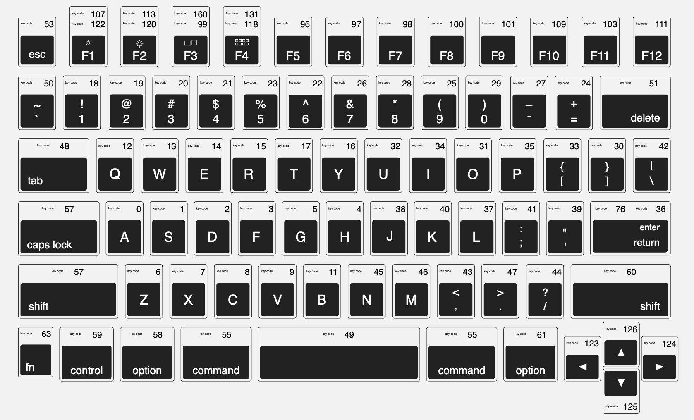

# MiniLibX Hook Examples


`keycode` and `mousecode` here are the MacOS ones, on Linux they are different (the escape key on Mac is 53, it's 65307 on Linux) and probably even different on Windows.


If you need to find what are hooks for MiniLibX, you can fin more information in the [Events](https://harm-smits.github.io/42docs/libs/minilibx/events.html) and [Hooks](https://harm-smits.github.io/42docs/libs/minilibx/hooks.html) chapter.

Here under I'll show you some examples hooks showing the most important values and some values that are not described in the documentation.


```c
#include "mlx.h"
#define WINDOW_HEIGHT 720
#define WINDOW_WIDTH 1280
int main(void)
{
/* 
 * this is the MLX initialisation, I only put it in the example so you can
 * better see what I am doing below
 */
    t_env *env;

    env.mlx = mlx_init();
    env.win = mlx_new_window(env.mlx, WINDOW_WIDTH, WINDOW_HEIGHT, WINDOW_NAME);
    env.img = mlx_new_image(env.mlx, WINDOW_WIDTH, WINDOW_HEIGHT);
    env.addr = mlx_get_data_addr(env.img, &env.bits_per_pixel, &env.line_length, &env.endian);
     /* end of MLX initialisation */
     /* Here I will be declaring the hooks, see below for their implementation.
     */
     mlx_hook(env.win, 4, 0, mouse_handler, &env);
     // mouse_handler will be called everytime a mouse down event is emitted
     mlx_hook(env.win, 2, 1L << 0, key_handler, &env);
     // key_handler will be called everytime a key is pressed
     mlx_hook(env.win, 17, 1L << 0, close_window, &env);
     // close_window is called when we click on the red cross to close the window
     mlx_loop_hook(env.mlx, render, &env);
     // Since MXL loops over and over again, we can use the mlx_loop_hook
     // to execute a function everytime MLX loops over.
     
     mlx_loop(env.mlx);
}
```


### Simple key\_pressed\_handler

Since you can filter if you you want to listen to the `keypress` or `keyrelease` event, you can have two different key handlers, you might want to start doing something when we press the `space` key and stop it only when you release it.


```c
int key_handler(int keycode, t_env *env)
{
    if (keycode == 53)
        ft_printf("ESCAPE");
    else if (keycode == 0 || keycode == 123)
        ft_printf("LEFT (A / ARROW_LEFT)");
    else if (keycode == 2 || keycode == 124)
        ft_printf("RIGHT (D / ARROW_RIGHT)");
    else if (keycode == 1 || keycode == 125)
        ft_printf("DOWN (S / ARROW_DOWN)");
    else if (keycode == 13 || keycode == 126)
        ft_printf("LEFT (A / ARROW_LEFT)");
    else
        ft_printf("%d\n", keycode);
    return (0);
}
```


<figure><figcaption><p>key code</p></figcaption></figure>


I think here you can see how you could find what `keycode` corresponds to any key on your keyboard by looking at this function.


### Simple mouse\_handler


```c
int mouse_handler(int mousecode, int x, int y, t_env *env)
{
    /* x and y parameters are the pixel coordinates of the mouse
     * in the window when the event was emitted
     * you can use them to check that the user clicked in a specific region
     * of the window
     */
     if (mousecode == 1)
         ft_printf("Left Click");
     else if (mousecode == 2)
         ft_printf("Right Click");
     else if (mousecode == 3)
         ft_printf("Middle Click");
     else if (mousecode == 4)
         ft_printf("Scroll UP");
     else if (mousecode == 5)
         ft_printf("Scroll DOWN");
     else if (mousecode == 6)
         ft_printf("Scroll right");
     else if (mousecode == 7)
         ft_printf("Scroll left");
     else
         ft_printf("%d\n", mousecode);
}
```


### mlx\_loop\_hook

This hook will call a function every time through the MLX loop, we can use this to update what we show on screen. That's why I called it `render` or `draw` most of the time.

For example, in `so-long` I use this hook to draw the map based on what changed. I draw the background completely again, to overwrite what was there, and then I redraw the walls and the player, but the player position can change based on `keypressed` events so the player moves along.\
The same way for collectibles, I don't want to draw them again if I already collected them (you can see the example I described [here](https://github.com/Laendrun/42/blob/main/so_long/src/main.c#L43)).

```c
int render(t_env *env)
{
    draw_background(env);
    draw_map(env);
    draw_player(env);
    draw_moves(env);
}
```


These are just examples and simple handlers so that you can better understand how this works and adapt it based on your needs.

