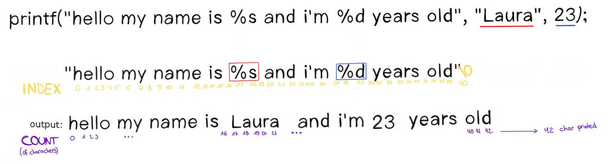

# ▪️ Building the thing

In this part, we will not give you the solution. We will try to describe the steps you need to go through to successfully write your own printf :)


The allowed functions for this project are: `malloc, free, write, va_start, va_arg, va_copy, va_end`. Any other function used will cause the project to fail


You will also have to make a Makefile and a header file with all the functions you will use.

## General Formulation

_The thing I love to do before coding is to start by stating the problem on paper. Describe each step precisely before going on an endless madness._ This is one way of thinking and one way to solve the problem, among many others.

1. The printf function will write each character of the intial string, one by one, until it finds a %.
2. When it finds a %, it will look at the element in the next index/position. It will find the character that will define the type of the first variable argument.&#x20;
3. Depending on what it finds, it will call a method that will display the argument of the particular type at output.\
   -> if there is a "s" after the %, then you will need a function that displays strings.\
   -> if there is a "d" after the %, then you will need a function that displays numbers.\
   etc.
4. Once the first variable argument has been written, you go back to step 1, until the string is finished (aka, until you find a null character (\0)).


(1 - 4): Don't forget to count the number of characters printed each time, in order to return the final number of characters at the end of the function.


## Specific example

Let's take a closer look at this example and <mark style="color:red;">**try to translate the next sentences into code.**</mark>&#x20;

<figure><figcaption>
visual example
</figcaption></figure>

1. Our program will write the characters from index 0 to 16, one by one, while incrementing the "count" variable. \
   &#xNAN;_-> At this stage of the program the printf function should have displayed "hello my name is " and the number the function returns is 17._
2. Once it encounters the '%' character, it stops writing and it will look one position further. \
   -_> At this stage we are pointing at the position/index 18._
3. The program will now check the type of the element in this position (the position after the %). In our case, the type of the first dynamic argument is 's' (%s).
4. You will have to print one by one, the characters of the type the program has just found. As it is a string, we can for example use the "putstr" function that we created in the "libft" project to print each character. Don't forget to also count the number of characters that will be printed from this string and to add it to the initial count.
5. Once the first dynamic argument (the one corresponding to %s) has been displayed, you can come back to the initial sentence and continue the work.\
   -_> At this stage of the program the printf function should have displayed "hello my name is Laura" and the number the function returns is 21 (= total of character displayed)._
6. Our program will then write again each character, one by one, from index 20 to 27 while incrementing the "count" variable.
7. The program will again find a % (position 28), stop writing and look for the next element.
8. The program will now check the type of the element in this position (the position after the %). In our case, the type of the second dynamic argument is 'd' (%d). That means that you will call a function that prints the number. \
   -_> At this stage of the program the printf function should have displayed "hello my name is Laura and I'm 23"._
9. Our program will then write again each character, one by one, from index 30 to the end while incrementing the "count" variable.\
   &#xNAN;_-> At this stage of the program the printf function should have displayed "hello my name is Laura and I'm 23 years old" and the number the function returns is 42 (42 characters printed in total)._

And that's it ! The printf project is pretty easy to get right! I won't give you the answer because it's always better to do it yourself (and this one is not that hard) :) I think the steps above should help you to succeed 80-90% of the project. Then there are some subtleties that I'll let you discover (spoiler alert: display a pointer or hexadecimal is a bit harder than displaying just a character).

Good luck with you printf... it will be a reallyyyy useful function for all the other projects that you will need to do&#x20;
