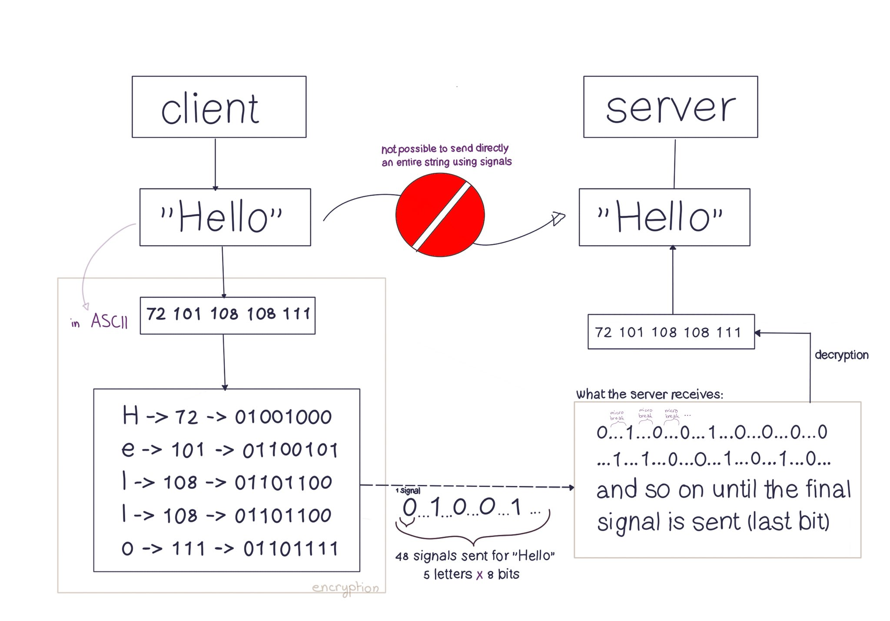

# ▪️ Building the thing

What I'll do here is create for you multiple checklists, that corresponds to different part of the project and that you can follow in order to build it. All the code for my "Minitalk" is available on my [Github](https://github.com/thebrisly/42-Cursus-Piscine/tree/master/minitalk). If you have any question on it, don't hesitate to [contact](../../team.md) me (Laura) and it would be a pleasure for me to answer all the questions you might have.

Let's go back to the chart I showed you at the [very beginning](understand-minitalk.md).

<figure><figcaption>
minitalk explanatory scheme
</figcaption></figure>

### Overview

We have a client that wants to send a message to the server. The message, "Hello" in our example, cannot be sent directly to the server. The client has to encrypt the message by sending a serie of signals (in my example I did it using bits, so 0's and 1's but if you find another method, feel free to do it) and the server has to decrypt/interpret it before it can be displayed.

**Why can't you just send a message directly ?** As I said before, a signal is a kind of notification that is sent to a process. In this project we will be able to use only two type of signals: `SIGUSR1` and `SIGUSR2`. That means that when the client sends the signal `SIGUSR1` to the server process, it will take a certain action. And it will do something else when it receives the SIGUSR2 signal.

Short example to understand why you can't just send a message directly

Each time the client sends the "SIGUSR1" signal to a server, it must display "Hello World". Each time the client sends the "SIGUSR2" signal to a server, the server must display a random number. You can send "SIGUSR1" or "SIGUSR2" to the server as many times as you want, and the server will ALWAYS display the same thing - i.e. "Hello World" and/or a number (depending on the signal received).

The code below will not work but it's for you to better understand what I'm saying.

<pre class="language-c" data-overflow="wrap" data-line-numbers><code class="lang-c">/*client*/

int main()
{
<strong>    kill(server_pid, SIGUSR1) //sends signal SIGUSR1 to a server
</strong>    kill(server_pid, SIGUSR2) //sends signal SIGUSR2 to a server
}

/* ---------------------------------------------------- */

/*server/

void	signal_handler(int signum)
{
    if (signum == SIGUSR1) //if the signal is equal to SIGUSR1 then he prints "Hello World"
	printf("Hello World);
    else if (signum == SIGUSR2)
         printf (" The random number is: %d", rand()); 
}

int main()
{
    sigaction(SIGUSR1, &#x26;signal_received, NULL); //every time it receives signal SIGUSR1 and will apply a specific function to it (signal handler)
    sigaction(SIGUSR2, &#x26;signal_received, NULL); //every time receives signal SIGUSR1 and will apply a specific function to it (signal handler)
}
</code></pre>

Here the SIGUSR1 signal is ONLY used to send the "Hello World" message to the server. If you want to send any other message, you won't be able to. Or you would need to change the output value again when the server receives SIGUSR1. Which is a bit annoying. It doesn't make much sense to go and change the server's output directly (and that would be cheating, because in the end you're not really sending a message, but just a signal that will send what you've pre-defined later).&#x20;

**The goal is that by using the SIGUSR1 and SIGUSR2 signals you can send a message - and it doesn't matter which one!**

So you have to find a way to decrypt a message so that the server can display any message that is typed from the console.

Here are two checklists to help you make your project a success:

### Client Checklist

In the "client.c" file, you will...

* [ ] Write a program (main) in which the client takes two parameters/arguments
  * [ ] The PID of the server to which it wants to send the message
  * [ ] A message
* [ ] Encrypt the message (I did the encryption via bits)
* [ ] Send the message to the server (via its PID)
* [ ] Create a stop condition so that the server knows when it has finished receiving the message

### Server Checklist

In the "server.c" file, you will...

* [ ] Display its PID
* [ ] Create an endless loop so that the server can receive signals at any time
* [ ] Receive signals
* [ ] Decrypt signals
  * [ ] For each signal received (SIGUSR1 & SIGUSR2) it should take a certain action

### Basic Checklist

Of course you will also need to do these three things:

* [ ] Makefile (create the "server" and "client" executables)
* [ ] Manage errors & remove all leaks
* [ ] Deal with the holy norminette

And that's all. Once you really understand the concepts, you'll see that this project is very simple! So now, I'll let you try to find a solution and solve this problem... good luck!
