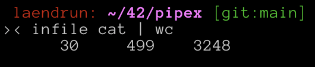
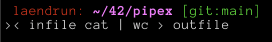
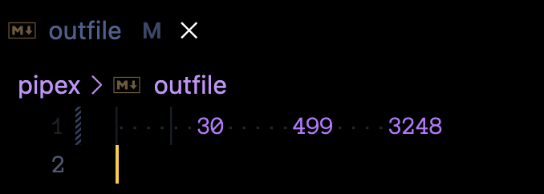
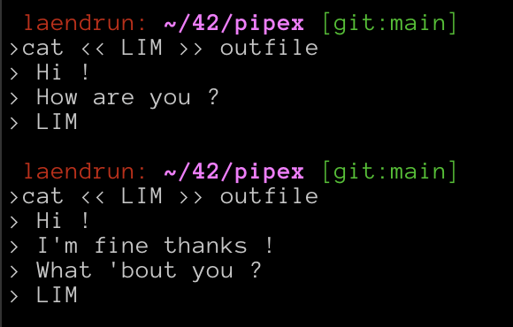

# ▪️ Understand pipex

### Goal

<details>

<summary>Project-specific guidelines</summary>

* Your program will be executed like this `./pipex file1 cmd1 cmd2 file2`
* `file1` and `file2` are filenames
* `cmd1` and `cmd2` are shell commands with their arguments
* Your program has to do the exact same thing as the following shell command
  * `$> < file1 cmd1 | cmd2 > file2`
* Your program must not leak any memory !

</details>

The goal of pipex is to develop a program that simulates the pipes in the shell.

This program will use a lot of new functions that we have never seen before, so I'll try to go over them all in the next section.

If you look at the example given in the subject, your program has to reproduce exactly the following shell command.

```shell
< file1 cmd1 | cmd2 > file2
```

Before going further, we have to understand clearly what this command does.

Let's take a command example and go through it left to right.

```shell
< infile grep a1 | wc -w > outfile
```

### < symbol

The `<` symbol is an "input redirection" symbol.

In that case, the `<` symbol redirects the content of `infile` to the `standard input` so that when `grep` is reading from the `standard input`, it gets the content of `infile`.

Let's use a more easy to understand syntax that works the same way.

```shell
grep a1 < infile | wc -w > outfile
```

This way, we can better see that the content of the `infile` is used by the `grep` command.

<figure><figcaption></figcaption></figure>

### | symbol

The `|` (pipe) symbol redirects the `output` of the command on the left to the `input` of the command on the right.

In that case, the `|` symbol redirects the `output` of the `grep` command to the `input` of the `wc` command.

<figure><figcaption><p>Without <code>|</code> symbol</p></figcaption></figure>

Without the pipe symbol, the output of the grep command is written directly to the standard output, let's add the pipe symbol in now.

<figure><figcaption><p>Redirecting <code>grep</code> result to <code>wc</code> using the pipe symbol</p></figcaption></figure>

As you can see, the output is now the result of the `wc` command, but the result of the `wc` command on the result of the `grep` command. That's why you see 20, if you count the number of words we had before when running only grep, that is 20.

### > symbol

The `>` symbol is an "output redirection" symbol.

In that case, the `>` symbol writes the `output` of the `wc` command into the `outfile`.

<figure><figcaption><p>That's the result of the command without the <code>></code> symbol</p></figcaption></figure>

<figure><figcaption><p>The same command with the <code>></code> symbol, there's nothing to see on the standard output.</p></figcaption></figure>

Actually, both commands give the same result, the `infile` didn't change between both, but the second time, the output was written in the `outfile` file, let's take a look at it.

<figure><figcaption></figcaption></figure>

### >> symbol

The `>>` symbol does almost the same thing as the `>` symbol. The `>` symbol replaces the content of the file on the right with the output of the command on the left. The `>>` symbol appends the output of the command on the left at the end of the file.

<figure><figcaption><p><code>>></code> example</p></figcaption></figure>

Let's take a look at what the `outfile` looks like after these two commands.

<figure><figcaption></figcaption></figure>

### << symbol

There's also this thing for the bonus `<<`.

The `<<` symbol is an input "redirection" symbol. It makes the shell read from the standard input until it encounters **only** a specific `LIMITER` on the stdin. Let's ake a look at the example from the subject.

```shell
cmd << LIMITER | cmd1 >> file
```

<figure><figcaption><p><code>&#x3C;&#x3C;</code> example</p></figcaption></figure>

As you can see, the first `cat` command waited until I wrote `LIM` and **only** `LIM` on the stdin before going further. Your `pipex` should do the same.

<figure><figcaption></figcaption></figure>
