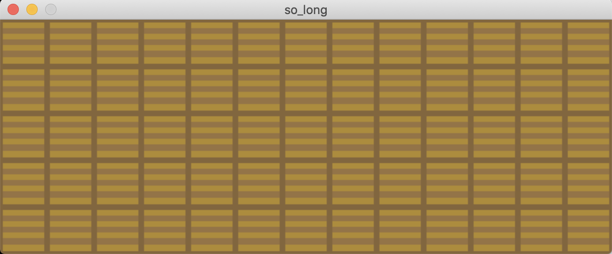
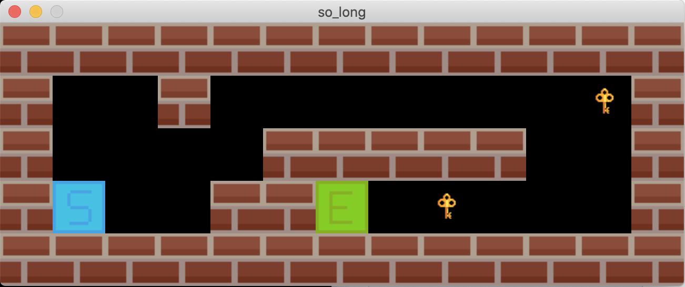
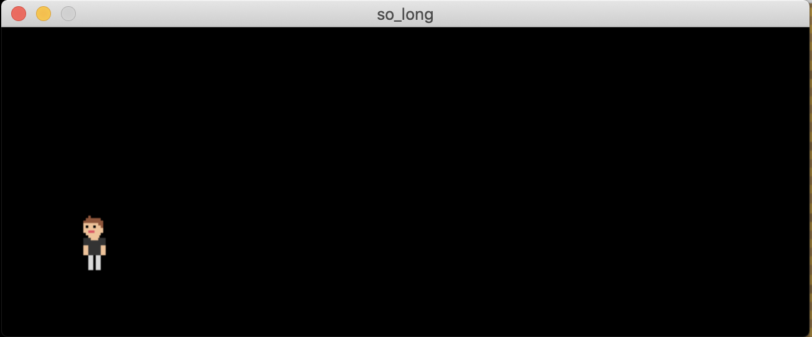
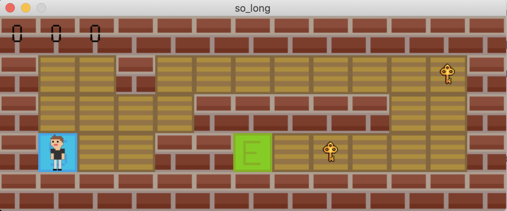
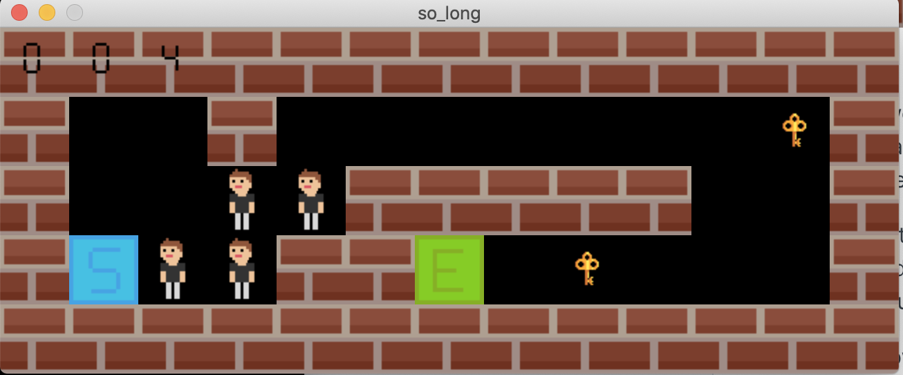

# ▪️ Core concepts

### Game loop

In most games, one of the core concept is the game loop. What is a game loop ?&#x20;

Well, the game loop is... a loop... but like with more spiciness to it.

Seriously, a game loop is the part of the game that handles the logic for updating and rendering the game. It is a continuous loop that typically runs at a fixed rate (such as 60 frames per second) and is responsible for performing the following tasks:

1. Processing input: The game loop retrieves and handles input from the player, such as keyboard or controller input.
2. Updating the game state: The game loop updates the game's data and objects based on the input and any other events that have occurred.
3. Rendering the game: The game loop generates graphics and audio output based on the updated game state.
4. Pausing and sleeping: The game loop may pause or sleep between iterations to maintain a consistent frame rate or to save resources on the device.

The game loop is an essential part of a game's architecture, as it determines how the game responds to player input and how it presents itself to the player.

With `MiniLibX`, we can do almost everything a game loop does by using the `mlx_loop_hook()` function, but we still have some limitations, like the framerate, we can't (or I didn't find how) limit the framerate of the game. We can't play sounds with it neither. And all the other parts, we can build them ourselves using the different hooks that MLX gives us (key hooks and mouse hooks).

### Rendering the game

One way to render the game that is the easiest to build for a simple 2D game like what we have to build for so\_long, is to draw the game as multiple layers each time through the loop.

For example, you could have a layer for the background that is the first one you draw.\
Then you draw the non-moving part of the map (walls, starting position, exit position and collectibles).\
And finally you draw the player at the player position.

By doing so, you basically have a clean canvas every time through the loop, and if something moved between two iterations, you don't have it all on screen.

Let's take a look at what the game looks like when I only draw one or the other layer.

<figure><figcaption><p>This is what the game looks like when I only draw the background.</p></figcaption></figure>

<figure><figcaption><p>This is what the game looks like when I only draw the map.</p></figcaption></figure>

<figure><figcaption><p>This is what the game looks like when I only draw the player.</p></figcaption></figure>

Now, let's draw all the layers in the correct order.

<figure><figcaption><p>This is what the game looks like when all layers are drawn in the correct order.</p></figcaption></figure>

I won't make a screenshot of every way I can render the game (rendering only the background and player or only the map and player) because I'm sure you can easily make that up in your head what the game would look like in any of these way.

With the three layers I have put here, I'm sure you can already see why drawing them in the correct order is useful. You can see that the background draws the "floor" on the complete window, so if you drawn something before drawing the map or the player, everything will be invisible behind it.

Now, you might wonder why I draw the background for every game loop iteration. Well, take a look at the following screenshot. Now I won't draw the background each time and make 2 or 3 moves to move the player.

<figure><figcaption><p>This is what happens when I don't draw the background every time through the loop.</p></figcaption></figure>

You can see that the player "multiplied" itself. I mean, it looks like it was multiplied, but actually, it's just that we see what was drawn during the previous loop iterations. We didn't drawn something over the background, and since it's not part of the map, it isn't redrawn every time. The player is drawn during each loop at its current position, but it once was on all these tiles.

By not rendering the background in every iterations, everything that was drawn on a tile where the background should be, will not be "overdrawn" and thus will still be visible even though the player moves around.

### Update player position

Since this is a video game that we are building, there surely will be a player or at least a character controlled (directly or indirectly) by the person playing your game.

The starting position for the player is known and can't be directly changed since it comes from the map that has to be parsed and checked by your program. That let's draw the player at the correct starting position but how could we update where the player should be showed on the window ?

Well, let's take an example map and how this could be working.

```
1111111111111
10010000000C1
1000011111001
1P0011E0C0001
1111111111111
```

As we can see here, the starting point of the player, as coordinates (y; x) is (3; 1).

That means, the first time through the game loop, we can draw the player at position (3; 1), but now, the player presses the right arrow key, the player should move to the right, right ?

How can you change where the player is drawn ? That's actually pretty easy. You can simply update the player position, we had (3; 1) the first time through the loop, when the player presses the right arrow key, we have to add 1 to the `x` coordinate of the player position. If we do this, we have now (3; 2). The next time through the game loop, the player will be draw at the "player position" coordinates, that is now (3; 2).&#x20;

To update the player position in other direction, we have to change the coordinates correctly depending on what key is pressed.&#x20;

Here's an example:


```c
int key_handler(int keycode, t_vars *vars)
{
    if (keycode == KEY_ARROW_RIGHT)
        vars->player.pos.x += 1;
    else if (keycode == KEY_ARROW_LEFT)
        vars->player.pos.x -= 1;
    else if (keycode == KEY_ARROW_UP)
        vars->player.pos.y -= 1;
    else if (keycode == KEY_ARROW_DOWN)
        vars->player.pos.y += 1;
    return (0);
}
```


I think that with these concepts you can already go a pretty long way in so\_long, if something is missing, don't hesitate to tell us and we'll update this page.

If you read everything until here, Iet's move to the next section and start actually building the thing.
