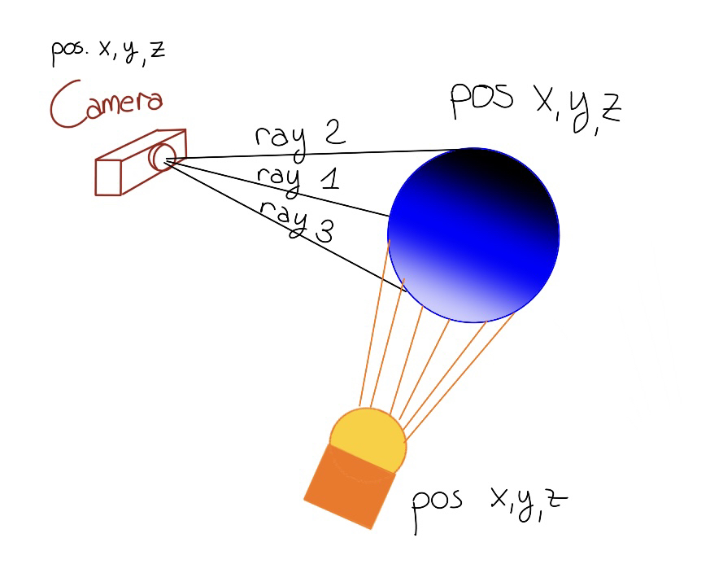

# Understand MiniRT

This project was made by me ([Laura](https://github.com/thebrisly)) and my fabulous mate ([fgrasset](https://github.com/fgrasset))! If you have any questions, don't hesitate to contact me on LinkedIn for example :-) I will be happy to help you !

We made a very, very minimalist RT without any bonuses because we wanted to go fast on it. But the bonuses shouldn't be too complicated to implement once you've got the hang of it ^^.

Anyway, let's get on with understanding the subject!

## What is raytracing ?

Raytracing is a powerful technique in computer graphics used to generate realistic images by simulating how light interacts with objects in a scene.&#x20;

Instead of just putting shapes on a screen, **it acts like virtual light**. It pretends to shoot rays of light from a pretend camera, and these rays bounce around, lighting up everything they touch. By doing this, **it creates pictures that look super real because it copies how light really behaves**. Other drawing methods don't copy light as well, so **raytracing makes things look more like they do in the world around us**.

Raytracing is incredibly effective at **producing high-quality and realistic images**, but it can also be quite **computationally intensive**. Because it simulates the behavior of light so accurately, it often requires a lot of calculations, which can slow down the rendering process.

Video games used to use faster ways to draw, called rasterization. Nowadays, they're adding raytracing to games, mixing it with traditional methods. New hardware helps with this mix, improving how things look without sacrificing speed. This combo is called hybrid rendering, giving both realism and speed.

Enough discussion. Let's see how the project works with diagrams.

## MiniRT in a nutshell

### Rendering example

Let's take a concrete example.

Imagine your program receives this scene :&#x20;

`A 0.2 255,255,255`\
`C 0,0,0 0,0,1 70`\
`L 0,0,-3 0.6`\
`sp 0,0,10 7 0,0,255`

This scene should show only one sphere (sp) with a light source (L) coming from below and one camera (C) capturing the scene from the zero position.

**The aim of the minirt project is to make a computer draw this scene in a realistic way.**

This is how it would look from our program:\
\
\[picture of our project]

Sounds nice nooop ? But we went through a lot of shit to do this lol. **Here are the steps we followed in order to succeed !**

### Steps to get there

To do this, the program first needs to figure out how to draw the sphere on the screen.

In a drawing, **it would look something like this**: (sorry for my poor drawing skills, but you've got a little representation at least)

<figure><figcaption></figcaption></figure>

Imagine your computer screen divided into tiny squares, each representing a pixel. $

For every pixel, we imagine **launching a special ray of light from the camera's viewpoint**. This ray is like a question: "What's there?"

As this ray travels, it might bump into objects in the scene, like the pink sphere you mentioned. If it hits the sphere, it's like the ray found an answer: "Ah, there's something here!"

Explanation based on the drawing

In my superb drawing, you can see that I'm shooting three rays from my camera towards my stage. All 3 rays will hit the object, but at 3 different points of light. The first point will be neither in shadow nor in direct light. The 2nd point will be in shadow and hardly visible from the camera's point of view (but still a little) and the last point, point 3, will be in direct contact with diffuse light - meaning it will be a point visible from the camera!

Now, because we're not just interested in the object but also in how it's lit, we take another step. **We send a new ray from that point where the first ray hit the object, but this time towards the light** **source**. If this second ray reaches the light source, it's like saying, "Hey, can I see the light from here?" If it does, we know that light is reaching that point on the object.&#x20;

If it doesn't reach the light source, it's because it intersects another object (if there is more than one in the scene) before reaching the light or because it is in the shadow!

**When light touches that point, we color it using the object's color**. So, in the case of the blue sphere, we'd color that point blue.&#x20;

And remember something. The closer a point is to the light and in direct contact with it, the brighter it will be! On the contrary, the further away it is, the shadier and darker (or even non-existent) it is.

By repeating this process for every pixel and every object, we create an image that looks realistic, with objects casting shadows and reflecting light just like they would in the real world. It's like painting with rays of light to capture the essence of the scene.

And... that's it (I promise, it really is !). But finding the right intersection, matrix and ray-tracing calculations takes time sometimes ! And you'll undoubtedly find other errors in your program along the way, which I'll list below.

You also need to think about optimizing your code so that it doesn't take 8 hours to display a scene :)

## Common error

One very common mistake you're bound to encounter:&#x20;

Your objects appear pixelated. Like this:

<figure><figcaption></figcaption></figure>

To solve this problem, I offer two suggestions :

Solution 1 

Just read the answer on this blog and you will understand everything : [https://stackoverflow.com/questions/23417736/ray-tracing-noise](https://stackoverflow.com/questions/23417736/ray-tracing-noise)&#x20;

Solution 2

Once you've pinpointed where the ray hits the object and you're sending another ray towards the light source, it's important to check if any other objects in the scene get in the way. This means going through the list of all the objects.&#x20;

Remember to exclude the object you're currently dealing with – this prevents it from accidentally causing issues by calculating itself. This precaution can help you avoid potential problems in your calculations.

That's it ! There is nothing more to know about this project. Or at least, I'll let you experiment with your code :D&#x20;
